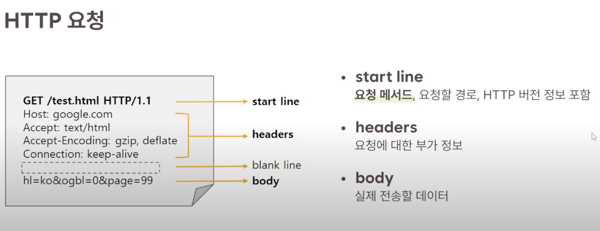
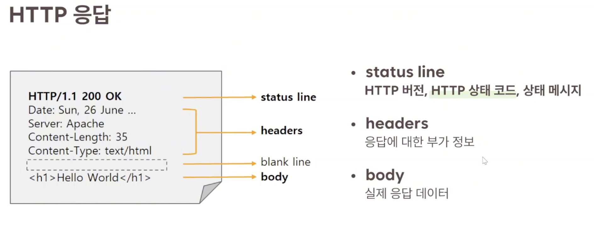
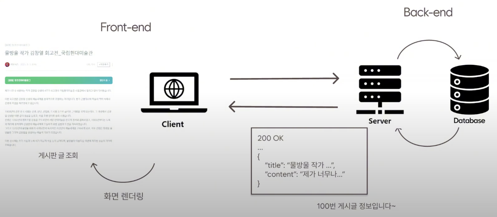
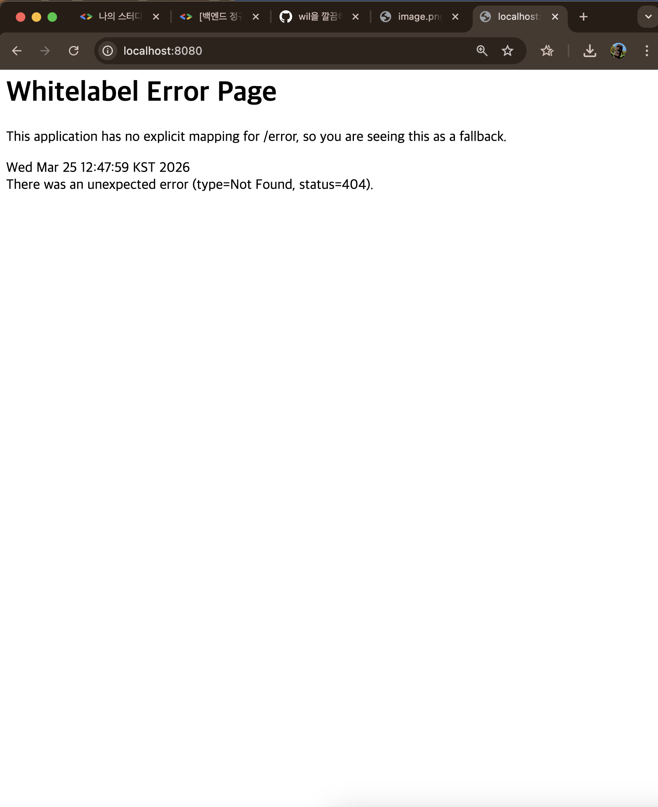

# 1. 1주차 학습 내용

---

## 웹(Web)이란?

인터넷 - 전 세계 컴퓨터와 기기를 연결하는 거대한 글로벌 네트워크 

웹 - 인터넷 위에서 동작하는 다양한 서비스들 중 하나로, 인터넷에 연결된 전 세계 사용자들이 서로의 정보를 공유할 수 있는 장소이다.

---

## 클라이언트 - 서버 모델

클라이언트 - 요청을 보내고 서버의 응답 결과를 받아 사용

서버 - 클라이언트의 요청을 받아 처리하고, 그에 대한 응답을 반환

## URL이란?

URL( Uniform Resource Locator )은 웹 상에서 특정 자원(웹페이지, 문서, 이미지 등)의 위치를 나타내는 웹의 고유 주소 체계이다. 

### [https](https://www.example.com:5883/category/food.html?topic=pizza)://www.example.com:5883/category/food.html?topic=pizza

`Scheme(Protocal)` - 컴퓨터와 같은 장치들 사이에서 데이터를 주고받는 방식, 통신을 위한 규칙
http, https 등

`Host` - 리소스가 위치한 서버의 IP 주소 혹은 도메인
[www.example.com](http://www.example.com/)

`Port` - 서버의 특정 네트워크 포트 번호 (일반적으로 생략한다.)
5883

`Path` - 서버 내에서 원하는 리소스의 경로
/category/food/html

`Query` - 서버에 추가적인 정보를 보내는 파라미터. ? 뒤에 key-value 형식으로 나열
?topic=pizza&size=large

## HTTP (HyperText Transper Protocal)

 : 웹에서 데이터를 주고받는 서버 - 클라이언트 모델의 프로토콜(규칙, 약속)
클라이언트의 요청과 서버의 응답을 통해 작동

- 무상태성(Stateless) - 서버는 클라이언트의 이전 요청을 저장하지 않고, 매 요청을 독립적으로 처리
- 비연결성(Connectionless) - 클라이언트가 요청을 보내고 응답을 받은 후 서버와 연결을 유지하지 않음

## HTTP의 요청 구조

- HTTP의 주요 메서드
`GET` - 리소스를 조회
`POST` - 리소스를 추가, 등록
`PUT` - 리소스를 교체, 없으면 새로 생성
`PATCH` - 리소스의 일부를 수정
`DELETE` - 리소스를 삭제

## HTTP의 응답 구조

- HTTP의 주요 상태 코드
`200 OK` - 요청이 성공적으로 처리됨
`201 Created` - 요청이 성공적으로 처리되어 새로운 리소스가 생성됨
`400 Bad Request` - 클라이언트의 요청이 잘못되어 서버가 이해하지 못함
`404 Not Found` - 지정한 리소스를 찾을 수 없음
`500 Internal Server Error` - 서버 내부 오류로 요청을 처리할 수 없음

## Front-end와 Back-end

Front-end - 사용자가 직접 보고 상호작용하는 화면, 사용자 인터페이스(UI)를 개발

Back-end - 사용자의 요청을 받아 실제 동작을 처리하고 데이터를 저장, 관리

DB (DataBase) - 데이터를 체계적으로 모아둔 저장소. 일반적으로 컴퓨터 시스템에 전자적으로 저장

- DBMS(데이터베이스 관리 시스템)으로 데이터베이스를 관리, 조작
-> 데이터 중복 해결, 독립성 확보, 무결성 유지
- 대표적인 DBMS : MySQL, PostgreSQL, MangoDB

## API 

api(Application Programming Interface)란, 한 프로그램이 다른 프로그램의 기능이나 데이터를 사용할 수 있도록 미리 정해놓은 약속이자 소통 창구. HTTP 규칙을 바탕으로 요청/응답 형식과 기능 목록을 정의

## REST와 REST API

REST (REpresentational State Transfer) :
네트워크 아키텍처 스타일로, HTTP의 장점을 최대한 활용할 수 있는 아키텍처, 원칙. 

### REST의 구성 요소 3가지
1. RESOURCE(자원) - URI
모든 자원은 고유한 ID를 가지며, 이 ID는 /student/1 같은 HTTP URI이다.

uri는 자원을 식별하는 문자열, url은 자원을 식별하는 문자열 + 위치까지 알려주는 주소로, uri가 url을 포괄하는 개념이다.

참고 ) path variable

: uri 일부를 변수처럼 사용해서 특정 자원을 식별하는 방식 (ex : /members/{memberId})

2. VERB(행위) - Method
자원을 조작하기 위해 HTTP method를 사용한다.

3. Representation(표현)
서버와 클라이언트가 데이터를 주고 받는 형식으로, JSON 형식이 일반적이다.

REST API :

REST API는 자원을 고유한 URI로 식별하고, 해당 자원에 대한 행위 VERB를 HTTP메서드(get, post, put, delete 등)로 정의하며, 그 결과를 JSON과 같은 표준 형식으로 표현하는 웹 서비스 아키텍쳐 스타일로, HTTP의 장점을 최대한 활용하여 설계된 API 가이드라인이라고 생각하면 된다.

- JSON (JavaScript Object Notation )
자바스크립트의 객체 문법을 기반으로 한 매우 가벼운 데이터 형식으로, 키-값 형태의 단순한 구조를 가진다. 웹 통신에서 데이터를 주고받을 때 널리 쓰인다.

## Spring과 Spring Boot

스프링 (Spring): 자바가 가진 객체 지향의 특징을 잘 살려 자바 백엔드 애플리케이션 개발을 빠르고 안정적으로 할 수 있도록 기본 구조와 규칙을 제공하는 가볍고 편리한 프레임워크이다.

스프링 부트 (Spring Boot): 스프링 프레임워크를 복잡한 초기 설정 없이 빠르고 쉽게 사용할 수 있게 해주는 도구이다.

---

# 2. White Laber Error Page 스크린샷

# 3. 온라인 쇼핑몰 프로젝트 API 명세서

- 상품 기능
    - 상품 등록 -> Post , /items
    - 상품 리스트 조회 -> Get , /items
    - 개별 상품 상세 조회 -> Get , /items{id}
    - 상품 정보 수정 -> Patch , /items/{itemsID}
    - 상품 삭제 -> Delete , /items/{itemsID}
- 주문 기능
    - 주문 정보 생성 -> Post , /orders
    - 주문 내역 조회 -> Get , /orders
    - 개별 주문 정보 상세 조회 -> Get , /orders/{ordersID}
    - 주문 취소 -> Delete , /orders/{ordersID}