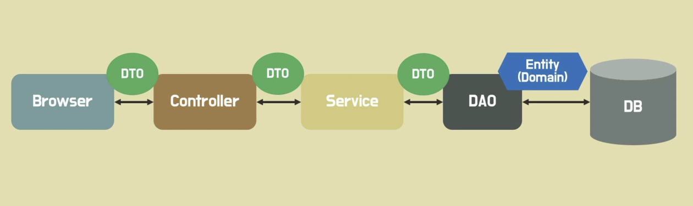
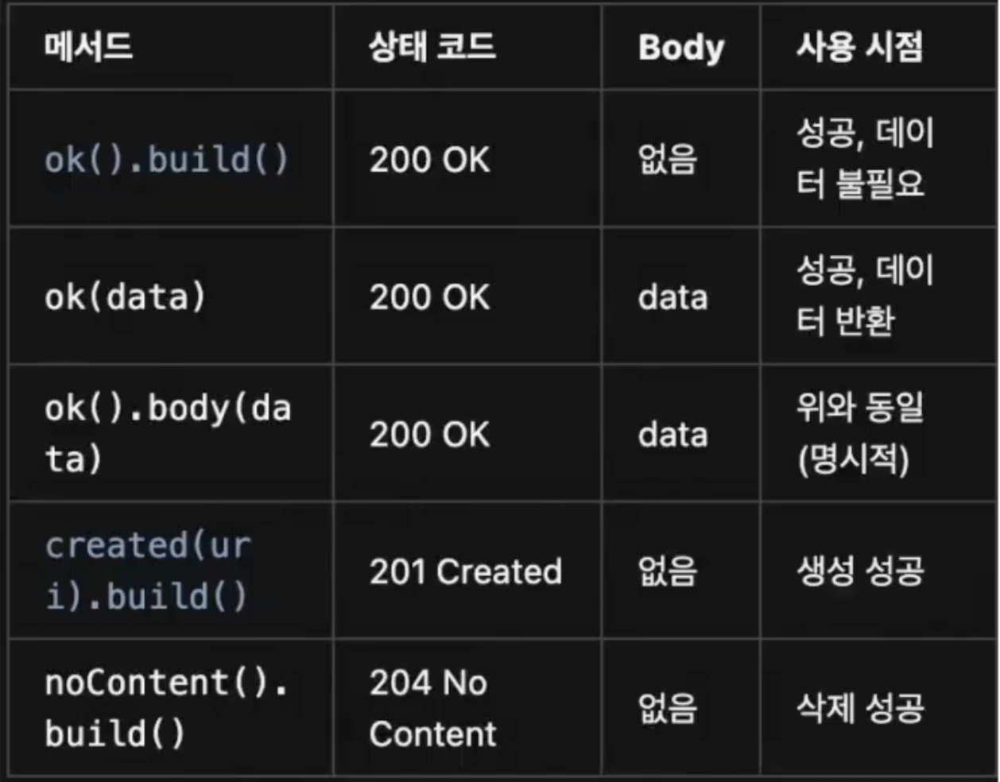
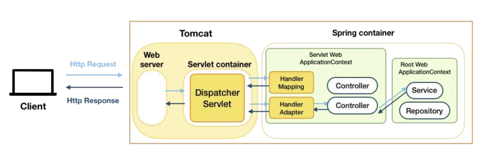

# 2주차 wil

## 스프링 계층 아키텍처 (Spring Layered Architecture)

### 브라우저 Browser

프론트엔드 또는 클라이언트 역할을 하며, 서버에 API 요청을 보낸다.

### 컨트롤러 Controller

브라우저(클라이언트)와 직접 소통하며 특정 엔드포인트로 들어오는 HTTP 요청을 가장 먼저 처리하고, HTTP 응답을 반환한다. 비즈니스 로직을 모르기 때문에 서비스 계층과 DTO를 사용하여 데이터를 주고받으며 작업을 지시한다.

### 서비스 Service

비즈니스 로직을 모두 알고 처리하는 핵심 계층으로, 컨트롤러와 레포지토리 사이에서 중계 역할을 한다.

### 레포지토리(DAO):

데이터 접근 객체(Data Access Object)로, 데이터베이스(DB)와의 입출력 및 관리를 담당한다.

참고) DB (냉장/냉동 창고): 실제 데이터가 저장되는 공간이다.

### 데이터 전달 객체(DTO)

DTO (Data Transfer Object)는 계층 간 데이터 전송을 담당하는 객체이다.

### 핵심 객체(Entity)

DB 테이블과 매핑되는 핵심 객체로, 데이터 일관성 및 보안을 위해 외부에 직접 노출시키지 않는다.

---

## 컨트롤러 (Controller) 계층 주요 어노테이션

@Controller: 스프링에게 자신이 컨트롤러임을 알려줌@Controller 어노테이션만 있으면 메서드의 리턴값을 View의 이름으로 인식하고 html과 같은 화면을 찾는다.

@RequestMapping: 클래스 레벨에서 정의하여 컨트롤러의 모든 세부 엔드포인트에 적용되는 공통 엔드포인트를 설정

@PathVariable: URL 경로에 포함된 변수({memberId}등)를 추출하여 특정 자원을 식별하는 식별자로 활용

@RequestBody: HTTP 요청의 본문(Body)에 담긴 JSON 데이터를 자바 객체(DTO)로 변환하는 역할

@ResponseBody:  메서드의 반환값을 View를 찾는데 사용하지 않고 HTTP 응답 본문(Body)에 직접 넣어주겠다는 뜻. 자바 객체를 JSON 등의 형식으로 자동 변환하여 전달함

@RestController: @Controller와 @ResponseBody의 기능을 합친 어노테이션으로, 메서드의 반환값을 HTTP 응답 본문(Body)에 직접 작성하게 해줌.

@ResponseEntity:  HTTP 응답을 세밀하게 제어할 때 사용. 상태 코드, 헤더, 바디를 직접 설정할 수 있게 도와준다.

@RequiredArgsConstructor : 모든 필드 값을 파라미터로 받는 생성자를 생성해줌

@NoArgsConstructor : 파라미터가 없는 디폴트 생성자를 생성해줌

## 트랜잭션(Transaction)

여러 개의 작업을 하나의 단위로 묶어 처리하는 개념을 말한다.

트랜잭션 내의 작업들은 원자성(Atomicity)을 보장해야 한다. 다시 말히면 모든 작업이 성공하거나, 하나라도 실패하면 모두 실패(롤백)해야 한다는 것이다.

@Transactional 어노테이션을 사용하면 스프링에게 해당 메서드가 트랜잭션 단위로 처리되어야 함을 명시할 수 있다. 데이터 수정이 없는 조회(GET) 메서드는 보통 readOnly = true 옵션을 붙여, 읽기 전용 옵션을 설정하여 성능을 최적화하고 수정 가능성을 막는다.

## 패키지 구조

- 계층형 구조

애플리케이션을 기능별로 나누는 방식.( 컨트롤러는 컨트롤러에, 서비스는 서비스에 )

- 도메인형 구조

member, product 등 도메인(기능 단위) 별로 패키지를 나누고 그 안에 컨트롤러, 서비스, DTO 등 모든 관련 클래스를 모아두는 방식. 새 도메인을 추가해도 다른 곳에 영향이 없고, 코드 탐색 및 유지보수에 용이하다는 장점이 있다.

## 스프링 빈과 의존성 주입

-> 스프링 애플리케이션 구조

### 스프링 빈 (Spring Bean)

애플리케이션 전역에서 사용되는 공용 객체를 말한다. 스프링 빈은 스프링 컨테이너(Application Context)라는 저장소에 보관된다.

필요한 빈은 스프링 프레임워크가 자동으로 가져다 준다. 빈을 요구하는 객체 역시 스프링 빈이다.

### 빈 등록 방법

스프링 빈을 등록하는 방법에는 아래 두 가지가 있다.

- 설정 파일 작성 (수동 등록)
- 컴포넌트 스캔 (자동 등록)
@RestController, @Controller, @Service, @Repository, @Component 등의 어노테이션이 붙은 클래스는 컴포넌트 스캔을 통해 자동으로 스프링 빈으로 등록된다.

(@SpringBootApplication 어노테이션 안에 @ComponentScan이 포함되어 있어서 스프링이 뜰 때 자동으로 빈 등록해줌)

### 의존성 주입 (Dependency Injection, DI):

객체가 의존하는 객체(다른 빈)를 직접 생성하지 않고, 스프링 컨테이너로부터 받아와 사용하는 방식.

객체를 매번 생성하지 않고 재사용하여 메모리 사용을 효율화할 수 있다는 장점이 있다.

### 의존성 주입 방법 3가지

- 생성자 주입
가장 권장되는 DI 방식

필드에 final로 선언한 뒤 생성자에 @Autowired를 사용
(만약 생성자가 하나만 있다면, @Autowired 생략 가능, @RequiredArgsConstructor을 통해 생성자도 생략 가능)

- 필드 주입
- 수정자 주입 (세터 주입)