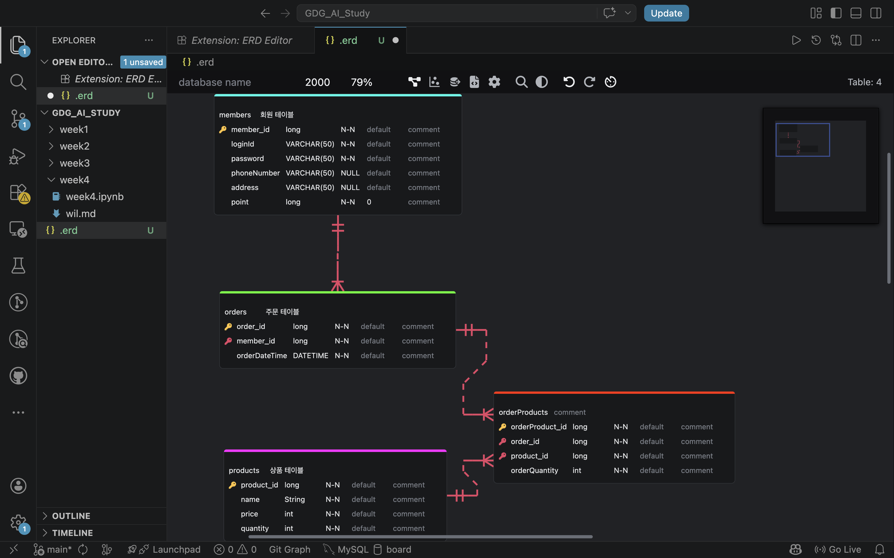
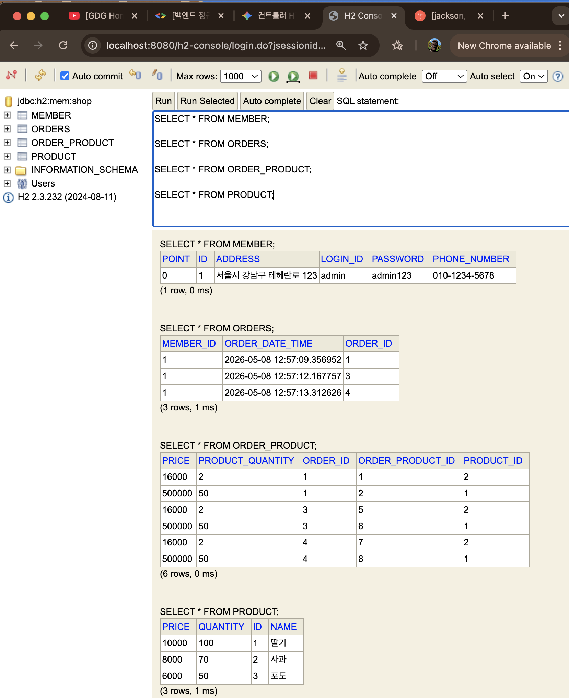
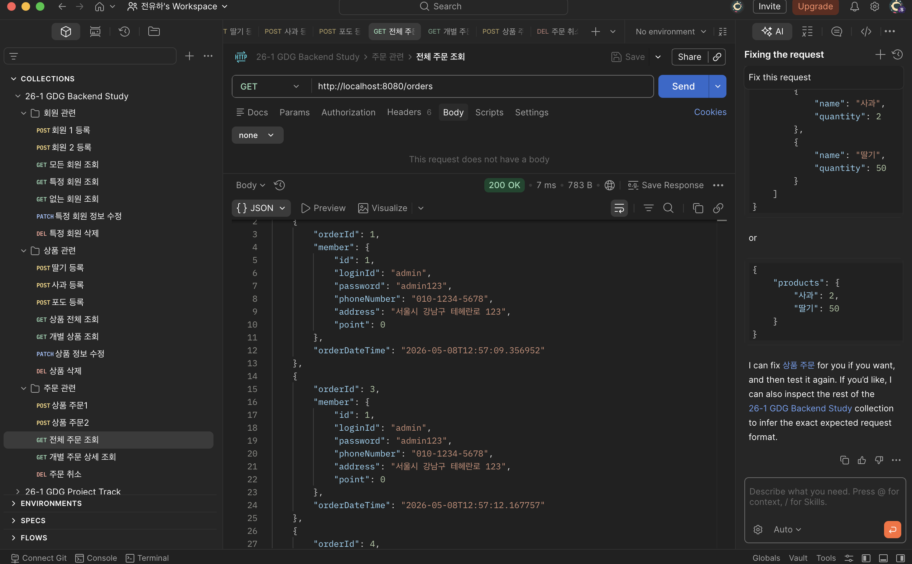
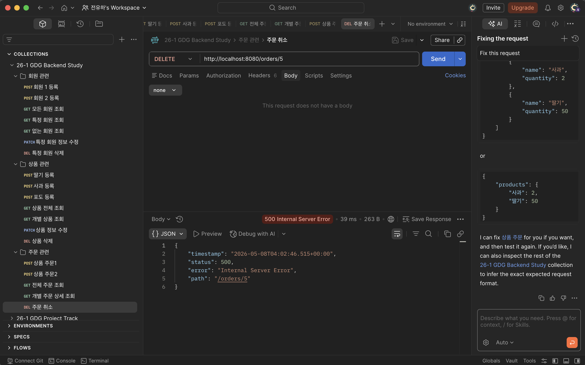

## DB 기본 용어 정리

- **Entity(개체):** 관리해야 할 데이터의 주체 (예: 회원, 상품, 주문).
- **Attribute(속성):** 엔티티가 가진 구체적 정보 (=필드/컬럼).
- **Primary Key(PK, 기본 키):** 각 데이터를 고유하게 식별하는 키.
- **Foreign Key(FK, 외래 키):** 다른 테이블의 PK를 참조하는 속성. 테이블 간 연결을 구현.
- **Relateion(관계)** : 개체(entity) 사이의 연관성, 업무 규칙(어떤 회원이 어떤 상품을 주문했는지). 테이블과 외래 키를 통해 구현한다.
- **ERD (Entity Relationship Diagram):** 개체 - 관계 중심의 데이터베이스 모델링 기법인 ER Model을 시각화한게 ERD. 데이터의 청사진이며 개발자 간, 클라이언트 간 소통 도구로 사용힌다.
- **식별 관계와 비식별 관계**
    - 식별 관계 : 강한 연관 관계 - 관계 대상의 PK를 자신의 PK로도 사용 - pk가 같은데 테이블 왜 나누지? 특별한 이유가 있겠지?
    - 비식별 관계 : 느슨한 연관 관계 - 관계 대상의 PK를 자신의 FK로만 사용, 보통 비식별 관계 사용함

## **관계의 종류:**

- **1:N (일대다)**

: 한 회원이 여러 주문을 하는 경우. (주문 테이블이 회원 ID를 FK로 가짐)(FK로 관계를 구현)

한 명의 회원은 여러 개의 주문 내역을 가진다. 

→ 회원과 주문의 관계는 1:N, 주문 테이블은 member_id를 FK로 가진다.

- **N:M (다대다)**

: 학생과 강의의 관계. 중간에 '매핑 테이블'을 두어 1:N, N:1 관계로 풀어내야 함.

한 명의 학생은 여러 개의 강의를 수강할 수 있고 하나의 강의는 여러명의 학생이 수강할 수 있다.

→ 학생과 강의는 다대다 관계.

이를 FK로만 구현하면?

학생은 여러개의 강의 수강 가능 : 강의가 학생의 PK를 FK로 사용하여 1:N

하나의 강의는 여러명이 수강 가능 : 학생이 강의의 PK를 FK로 사용하여 1:M

테이블(연결 엔티티)을 도입하여 이 둘을 묶어주자!

수강신청 테이블을 만들어 PK를 새로 지정하고(등록 번호 , 학번 등)로 하고 여기에 학생 id와 강의 id를 FK로 사용해서 연결해주자

## ENTITY

**Entity** : 자바가 DB와 소통하는 단위. 엔티티 클래스를 작성하면 JPA가 알아서 테이블 생성 SQL을 작성하고 실행해줌(JPA는 레포리토리 계층에선 CRUD SQL을 알아서 작성해줌

### Entity 주요 어노테이션 정리

- `@Entity`: DB 테이블과 매핑될 클래스임을 명시.
- `@Id`: PK 지정
- `@JoinColumn(name = "컬럼명")`: 외래 키 컬럼 정보를 명시
- `@GeneratedValue(strategy = GenerationType.IDENTITY)`: 기본 키 생성을 DB에 위임 (Auto Increment).
- `@Column`: 컬럼명, 길이(`length`), 널 허용 여부 등 설정.
- `@NoArgsConstructor(access = AccessLevel.PROTECTED)`: 파라미터 없는 기본 생성자 생성(JPA가 엔티티를 사용하려면 기본 생성자가 필요함). 외부 접근을 차단하고 JPA만 사용하게하기 위해 access 속성을 `protected` 하는 것을 권장. 참고로 엔티티 생성자는 보통 id는 제외하고 만든다.(id는 DB가 만듦)
- `@Getter`  : 모든 필드에 대한 get 함수 생성
- `@ManyToOne` , `@ManyToMany` , `@OneToManye` , `@OneToOne` : 관계 설정
- `fetch = FetchType.LAZY` (지연 로딩) 권장. 필요할 때만 연관된 객체 정보를 가져와 성능을 최적화함. `fetch = FetchType.EAGER` (즉시 로딩)은 객체 정보를 가져올 때 연관된 객체의 모든 정보를 함께 한번에 가져옴

## 엔티티 외래 키를 통해 연관 관계 매핑하는 법

엔티티 클래스 내부에 **상대 엔티티 객체**를 필드로 넣어준 뒤

`@ManyToOne`,`@JoinColumn`  어노테이션을 추가해주면 JPA가 알아서 잘 처리해준다.

---

## DB ERD 스크린샷

ERD 클라우드가 조금 불편한 것 같아서 VScode의 ERD Editor 익스텐션을 사용하여 그려봤습니다

## H2 테이블 스크린샷

## Postman 테스트 결과 스크린샷

#### 성공

orderId 1,2,3,4,5 총 5개의 주문 생성 후 orderId가 2,5인 주문을 삭제한 결과입니다

#### 실패

아까 성공했던 상태에서 orderId 5번 삭제 요청을 또 보내 실패한 상태입니다.